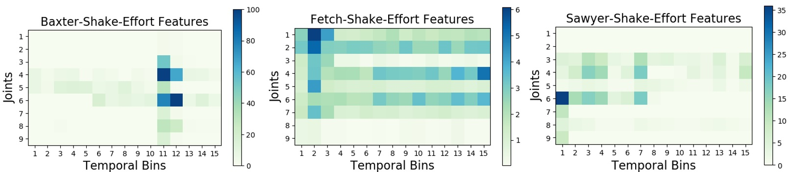

# Haptic Knowledge Transfer Between Heterogeneous Robots using Kernel Manifold Alignment

**Abstract:**

> Humans learn about object properties using multiple modes of perception. Recent advances show that robots can use non-visual sensory modalities (i.e., haptic and tactile sensory data) coupled with exploratory behaviors (i.e., grasping, lifting, pushing, dropping, etc.) for learning objects' properties such as shape, weight, material and affordances. However, non-visual sensory representations cannot be easily transferred from one robot to another, as different robots have different bodies and sensors. Therefore, each robot needs to learn its task-specific sensory models from scratch. To address this challenge, we propose a framework for knowledge transfer using kernel manifold alignment (KEMA) that enables source robots to transfer haptic knowledge about objects to a target robot. The idea behind our approach is to learn a common latent space from multiple robots' feature spaces produced by respective sensory data while interacting with objects. To test the method, we used a dataset in which 3 simulated robots interacted with 25 objects and showed that our framework speeds up haptic object recognition and allows novel object recognition.

## Development Environment

`Python 3.7.6` and `MATLAB R2019b update 3 (9.7.0.1261785)` are used for development and following packages are required to run the code:  

### Python Dependencies
`pip install scipy==1.1.0` 
`pip install sklearn=0.22.1` 
`pip install numpy==1.18.1` 
`pip install tensorflow-gpu==2.0.0` 
`pip install matplotlib==3.1.2` 
`MATLAB Engine API for Python`

### MATLAB Dependencies
`Statistics and Machine Learning Toolbox`

## [Dataset](Datasets)

- [Visualization of each modalities](DatasetVisualization.ipynb)

### Discretized Mean 10 bins

### Discretized Range 15 bins

### Dataset Collection

Baxter: https://github.com/medegw01/baxter_tufts  
Fetch: https://github.com/gtatiya/Fetch_Pick_and_Place  
Sawyer: https://github.com/medegw01/sawyer_tufts  

<table>

<tr>
<td>
	<a href="https://github.com/medegw01/baxter_tufts">Baxter</a>
	
</td>

<td>
	<a href="https://github.com/gtatiya/Fetch_Pick_and_Place">Fetch</a>
	
</td>

<td>
	<a href="https://github.com/medegw01/sawyer_tufts">Sawyer</a>
	
</td>
</tr>

</table>

## How to run the code?

### Speeding up object recognition

Baseline condition: `python MulitBehaviorsObjectClassification.py`  
Transfer condition: `python MulitBehaviorsOC_KEMA.py`

### Novel object recognition

`python MulitBehaviorsNovelOC_KEMA.py`

## Results (Discretized Mean 10 bins)

### Illustrative Example

### Speeding up object recognition results

#### Baster as Target Robot

#### Fetch as Target Robot

#### Sawyer as Target Robot

### Novel object recognition results

#### Baster as Target Robot

#### Fetch as Target Robot

#### Sawyer as Target Robot

